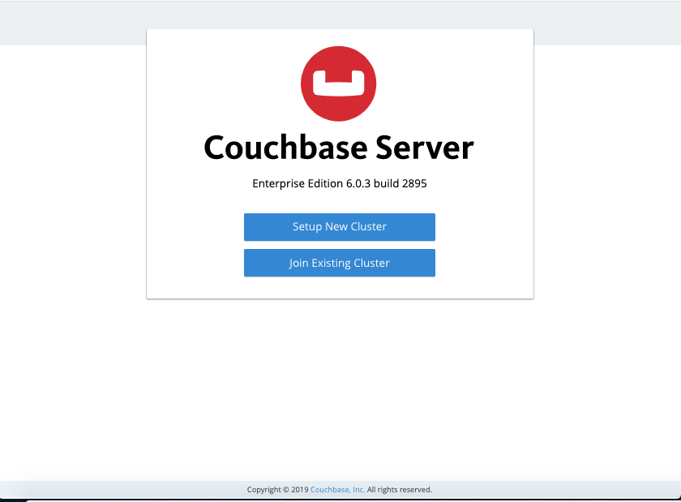

# Plus Medical [Backend]

API for plus-medical using docker - express - couchbase

## QuickStart with Couchbase Server and Docker

Here is how to get a single node Couchbase Server cluster running on Docker Compose:

**Step - 1** : Build the app with docker-compose

```console
docker-compose -f local.yml build
```

**Step - 2** : Run the app with docker-compose

```console
docker-compose -f local.yml up
```

**Step - 3** : Next, visit `http://localhost:8091` on the host machine to see the Web Console to start Couchbase Server setup.



**Step - 4** : Create a new bucket named _plus-medical_.


**Step - 5** : Add new user named _plus-medical_ with role **Application Access**.


**Step - 6** : Create `.env` file using `.env.example` as template:

```
DB_PASSWORD=*****
DB_URL=couchbase://db
DB_NAME=plus-medical
```

**Step - 7** : See the request documentation at
[API Documentation](https://documenter.getpostman.com/view/1710498/SztEZ6YA?version=latest).

## Testing and coverage

Test and coverage procedure ...

## Contributors

Edwin García  
spark.com.co@gmail.com

Wilson Romero  
me@wilsonromero.com
